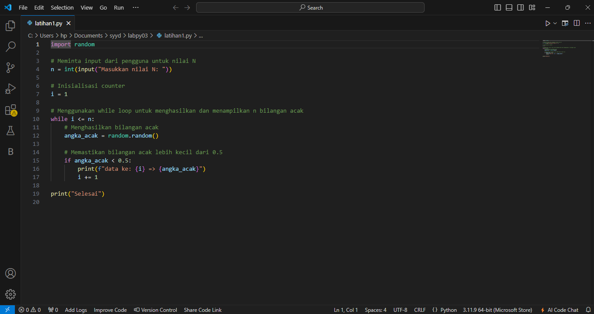
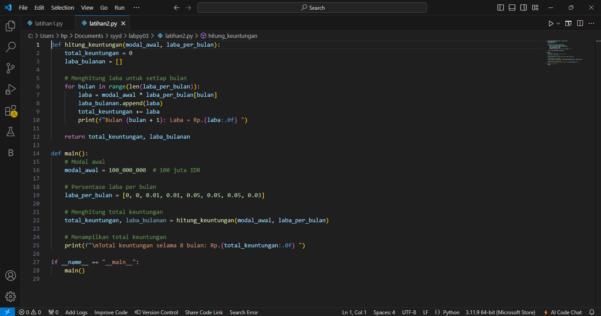

# labpy03
Nama : Sayyid Sulthan Abyan 

Nim : 312410496 

Kelas : TI.24.A.5 

Mata kuliah : Bahasa pemrograman 

## `Latihan1: Angka random`
1.Mulai Program :
• Import modul random.
- Minta input dari pengguna untuk nilai n (jumlah bilangan acak yang ingin ditampilkan).
  
2.Inisialisasi Variabel :
- Inisialisasi variabel count dengan nilai 0 untuk menghitung jumlah bilangan acak yang sudah dihasilkan.

3.Looping:
- Gunakan loop while untuk terus menghasilkan bilangan acak hingga jumlah yang diinginkan tercapai (count < n).

4.Menghasilkan Bilangan Acak:
- Di dalam loop, gunakan random.random() untuk menghasilkan bilangan acak antara 0 dan 1.

5.Memeriksa Bilangan Acak:
- Periksa apakah bilangan acak yang dihasilkan kurang dari 0.5.
- Jika ya, tambahkan nilai count dengan 1 dan cetak bilangan tersebut dengan format “Data Ke {count} = {random_number}”.

6.Akhir Looping:
- Ulangi langkah 4 dan 5 hingga count mencapai nilai n.

7.Selesai:
- Program selesai setelah menampilkan n bilangan acak yang kurang dari 0.5.`
### Program python

### Hasil eksekusi program 
ini hasil eksekusi program python diatas

## `Latihan2: Laba`
### Program python

### Hasil eksekusi program 
ini hasil eksekusi program python diatas

## `Latihan3: Mesin atm`
### Flowchart

### penjelasan untuk Flowchart di atas
**1.Mulai (Start):** Proses dimulai. 
**2.Inisialisasi saldo:** Saldo awal diatur menjadi Rp. 100.000.000. 
**3.Tampilkan menu:** Sistem menampilkan menu dengan tiga opsi: 
-Tarik tunai 
-Cek saldo 
-Keluar
**4.Input pilihan menu:** Pengguna memasukkan pilihan mereka (1, 2, atau 3). 
**- Jika Pilihan = 1 (Tarik Tunai):** 
**5.Input jumlah tarik :** Pengguna memasukkan jumlah uang yang ingin ditarik. 
**6.Jumlah Tarik <= saldo? :** Sistem memeriksa apakah jumlah tarik lebih kecil atau sama dengan saldo. 
**7.Jumlah Tarik > 0?:** Sistem memeriksa apakah jumlah tarik lebih besar dari 0. 
**8.saldo = saldo - jumlah tarik :** Sistem mengurangi saldo dengan jumlah tarik. 
**9.Print saldo :** Sistem mencetak saldo yang diperbarui. 
**- Jika Pilihan = 2 (Cek saldo):** Print saldo (Print balance):Sistem mencetak saldo. 
**- Jika Pilihan = 3 (Keluar):** "Terima kasih telah menggunakan mesin ATM ini" :Sistem menampilkan pesan terima kasih. 
**10.Selesai (Finish):** Proses berakhir. 

### Program python
seperti ini jika algoritma yang dibuat dalam bentuk flowchart di atas, di jadikan sebuah program python

### Hasil eksekusi program 
ini hasil eksekusi program python diatas

