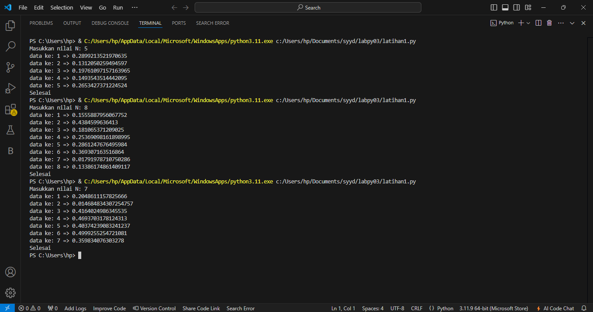
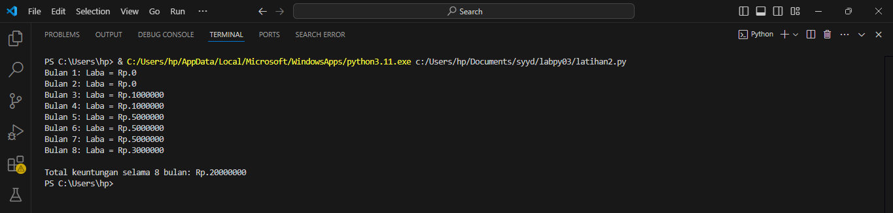

# labpy03
Nama : Sayyid Sulthan Abyan 

Nim : 312410496 

Kelas : TI.24.A.5 

Mata kuliah : Bahasa pemrograman 

## Latihan1: Angka random
### Program python

### Hasil eksekusi program 
ini hasil eksekusi program python diatas

## Latihan2: Laba
### Program python

### Hasil eksekusi program 
ini hasil eksekusi program python diatas

## Latihan3: Mesin atm
### Flowchart 

### penjelasan untuk Flowchart di atas
**1.Mulai (Start):** Proses dimulai. 

**2.Inisialisasi saldo:** Saldo awal diatur menjadi Rp. 100.000.000. 

**3.Tampilkan menu:** Sistem menampilkan menu dengan tiga opsi: 

-Tarik tunai 

-Cek saldo 

-Keluar 

**4.Input pilihan menu:** Pengguna memasukkan pilihan mereka (1, 2, atau 3). 

**-Jika Pilihan = 1 (Tarik Tunai):** 

**5.Input jumlah tarik :** Pengguna memasukkan jumlah uang yang ingin ditarik. 

**6.Jumlah Tarik <= saldo? :** Sistem memeriksa apakah jumlah tarik lebih kecil atau sama dengan saldo. 

**7.Jumlah Tarik > 0?:** Sistem memeriksa apakah jumlah tarik lebih besar dari 0. 

**8.saldo = saldo - jumlah tarik :** Sistem mengurangi saldo dengan jumlah tarik. 

**9.Print saldo :** Sistem mencetak saldo yang diperbarui. 

**-Jika Pilihan = 2 (Cek saldo):** Print saldo (Print balance):Sistem mencetak saldo. 

**-Jika Pilihan = 3 (Keluar):** "Terima kasih telah menggunakan mesin ATM ini" :Sistem menampilkan pesan terima kasih. 

**10.Selesai (Finish):** Proses berakhir. 

### Program python
seperti ini jika algoritma yang dibuat dalam bentuk flowchart di atas, di jadikan sebuah program python

### Hasil eksekusi program 
ini hasil eksekusi program python diatas

